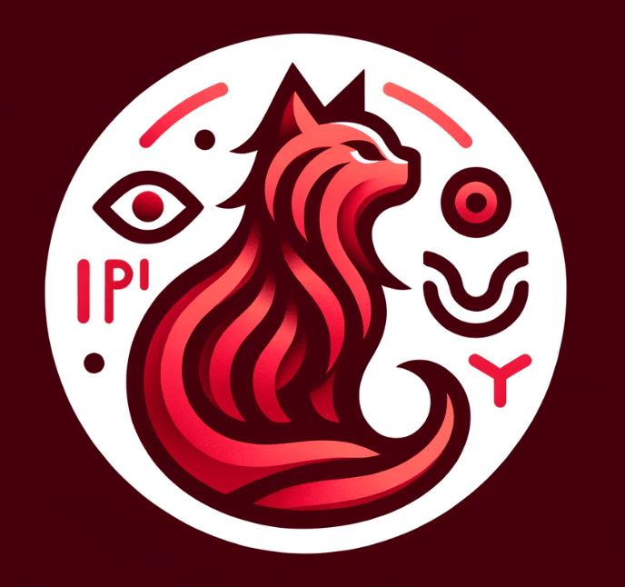

<p align="center">
  <picture>
    <source srcset="./assets/logo.png">
     <!-- Logo height increased from 60px to 120px -->
  </picture>
  <p align="center">
    Restfull API using Typescript, Nestjs and Prisma
    <br />
    <br />
  </p>
</p>

# NestJS API Readme

This is a NestJS API created by Aymene Bousbia. It uses PostgreSQL as the database and Docker for containerization.

## Author

**Aymene Bousbia**
- Github: [@aymene01](https://github.com/aymene01)

## Prerequisites

-   Node.js and npm installed on your system
-   Docker and Docker Compose installed on your system

## Getting started

Clone the repository to your local machine:

```bash
git clone git@github.com:aymene01/nestjs-final-test.git
```

Navigate to the project directory:

```bash
cd nestjs-final-test
```

You can run this command to setup the entire environement (install dependencies, database, etc)
```bash
npm run setup
```

Start the dev server:

```bash
npm run start:postgres
```

Run test

```bash
npm run test:e2e:postgres
```
